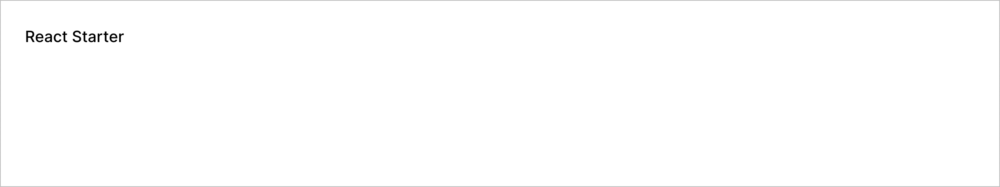

# Shadcn Starter

A minimal template to get started with React and
[shadcn/ui](https://ui.shadcn.com/).

**Tech Stack**

1. Framework: React 19 + Vite 6 + React Router 7
2. Styling: TailwindCSS 4 + shadcn/ui
3. Linting: Code Shaper ESLint configuration



## Prerequisites for development

1. Install [Node Version Manager](https://github.com/nvm-sh/nvm) (nvm). It
   allows using different versions of node via the command line
2. Run `nvm use` to use the required version of node.
3. Run `pnpm i` to install required packages.

## Development Build

```shell
pnpm dev
```

Now point your browser to http://localhost:3000

## Production Build

```shell
pnpm build
pnpm preview
```

Now point your browser to http://localhost:3000

## All Commands

```
pnpm build            # builds the prod bundle
pnpm clean            # deletes all build artifacts
pnpm dev              # runs the dev build
pnpm fix              # lints, formats and attempts to fix any issues (requires `pnpm build` has been ran)
pnpm lint             # runs the linter, useful for debugging lint issues (generally `pnpm fix` is preferred)
pnpm preview          # runs the prod build
```
